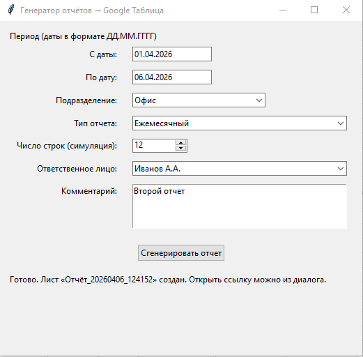
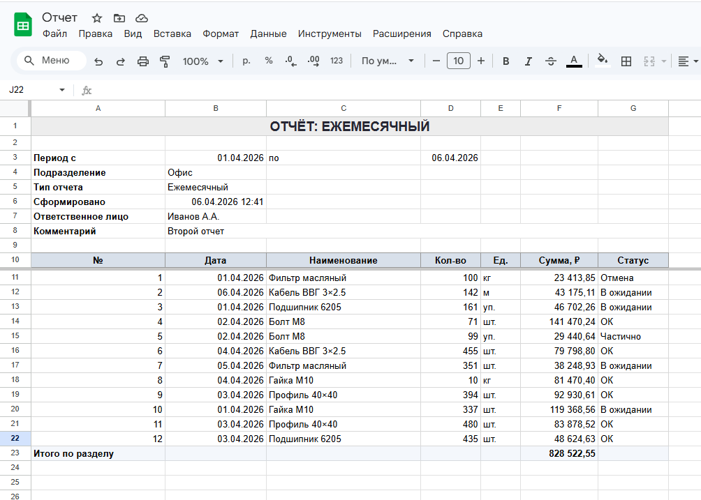

# Генератор отчетов

## Краткое описание

**AUTOReport** — десктопное приложение для подготовки отчётов: вы задаёте период, подразделение, тип периодичности отчёта, ответственное лицо и комментарий, после чего программа генерирует таблицу с **симулированными** данными и записывает результат в **Google Таблицу** в виде оформленного листа (заголовок, блок реквизитов, таблица с итогом).

Проект полезен для демонстрации сценария «форма → красивый лист в облаке» без ручной вёрстки в Excel и для отработки интеграции с Google Sheets API.

## Использованные технологии

| Категория | Технология |
|-----------|------------|
| Язык | Python 3 |
| GUI | **Tkinter** (входит в стандартную поставку Python на Windows) |
| Конфигурация | **python-dotenv** (переменные из `.env`) |
| Google APIs | **google-api-python-client**, **google-auth** (OAuth2 сервисного аккаунта) |
| Облачный сервис | **Google Sheets API v4** (таблицы, значения, форматирование через `batchUpdate`) |

## Реализованный функционал

- Окно ввода: период (даты «с» / «по»), подразделение, тип отчёта (ежедневный / еженедельный / ежемесячный / квартальный / годовой), число строк симуляции, ответственное лицо (из списка), комментарий.
- Генерация случайных строк таблицы (даты в выбранном диапазоне, номенклатура, количество, сумма, статус).
- Создание **нового листа** в указанной Google Таблице с именем вида `Отчёт_ГГГГММДД_ЧЧММСС`.
- Запись значений и оформление: объединение ячеек заголовка и блока комментария, стили шапки, границы, ширины колонок, числовой формат сумм, закрепление строк.
- Опциональное открытие таблицы в браузере после успешной записи.
- Модуль `google_sheets_crud.py`: чтение/запись диапазонов, `append`, `clear`, `batchUpdate`, добавление листа.

## Инструкция по запуску

1. **Клонируйте или скопируйте** каталог проекта на свой компьютер.

2. **Создайте виртуальное окружение** (рекомендуется) и установите зависимости:

   ```bash
   python -m venv venv
   venv\Scripts\activate
   pip install -r requirements.txt
   ```

3. **Настройте доступ к Google Sheets:**

   - В [Google Cloud Console](https://console.cloud.google.com/) включите API Google Sheets для проекта.
   - Создайте **сервисный аккаунт**, скачайте JSON-ключ.
   - Положите файл ключа в корень проекта (или укажите путь в переменной окружения `GOOGLE_APPLICATION_CREDENTIALS`).
   - Создайте таблицу в Google Sheets и **предоставьте сервисному аккаунту** роль редактора (поделиться по email из JSON, поле `client_email`).

4. **Файл `.env`** в корне проекта:

   ```env
   GOOGLE_SPREADSHEET_ID=<ID_из_URL_таблицы>
   ```

   ID берётся из ссылки: `https://docs.google.com/spreadsheets/d/<ID>/edit`.

5. **Запуск приложения:**

   ```bash
   python report_app.py
   ```

   Либо с активированным venv: `venv\Scripts\python.exe report_app.py`.

## Доступы

| Ресурс | Как получить доступ |
|--------|---------------------|
| **Код** | Локальная копия репозитория / папки проекта; при использовании Git — права на репозиторий у владельца. |
| **Приложение** | Запуск только на машине пользователя (`report_app.py`), веб-интерфейса нет. |
| **Google Таблица** | Откройте таблицу по ссылке из браузера после генерации или вручную: `https://docs.google.com/spreadsheets/d/<GOOGLE_SPREADSHEET_ID>/edit`. Доступ определяется настройками Google-аккаунта и правами на файл. |
| **Сайт / бот** | Не используются. |

## API и команды

**HTTP API у проекта нет** — это не сервер и не бот.

Используется **клиент Google Sheets API** из кода:

| Возможность | Назначение |
|-------------|------------|
| `spreadsheets.values.update` | Запись диапазона ячеек (тело отчёта) |
| `spreadsheets.batchUpdate` | Форматирование, объединение ячеек, ширины колонок, закрепление, новый лист |
| `spreadsheets.get` | Метаданные таблицы (листы, `sheetId`) |

В модуле `google_sheets_crud.py` это обёрнуто в методы `GoogleSheetsClient`: `read_range`, `update_range`, `append_rows`, `batch_update`, `add_sheet` и др.

Отдельных «команд бота» или публичных эндпоинтов нет.

## Статус проекта

**В разработке / рабочий прототип:** основной сценарий (форма → лист в Google Таблице) реализован; данные в таблице **симулированные**.

**Возможные доработки:** подключение реальных данных вместо генератора, выбор существующего листа, экспорт в PDF, планировщик по расписанию, упаковка в исполняемый файл (PyInstaller и т.п.).

## Скриншоты ключевых экранов

> В репозиторий скриншоты по умолчанию не включены. Добавьте изображения в каталог, например `docs/screenshots/`, и вставьте ссылки ниже.

**Главное окно приложения (форма параметров отчёта)**




**Пример созданного листа в Google Таблице**




